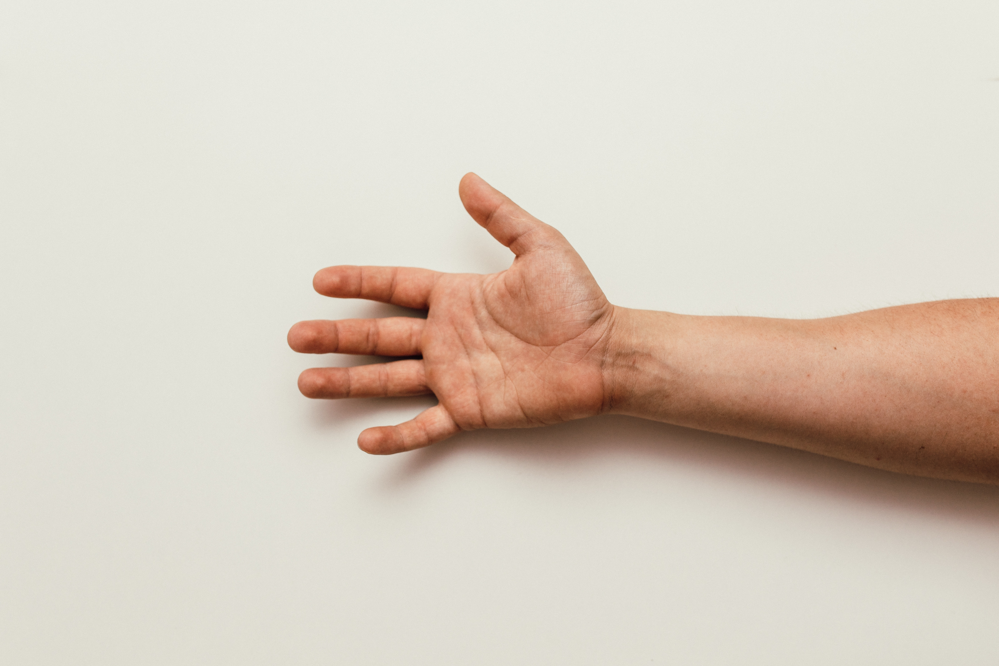

Just by using your hands you can know how much to eat depending on your goals.

Ingredients:

  

*Your palm and thumb*

  

*Your fist*

We'll keep it simple. There are two ways of architecting a fitness-aware **plate of food**:

### 1. Low carb

You should use this estimate for lunch and dinner if your goal is to lose weight.
If you trained that day, you should eat 1 plate as Low Carb and another as High Carb.

Add the following to your plate:

- 1/2 *palms* of protein
- 2/3 *fists* of vegetables
- 2/3 *thumbs* of fatty food - if it's vegetable or fish oil use less than a half of a thumb as a guide for each unit; if it's olives or dry fruits use half a fist
- 0/1 *fist* of starchy vegetables like potato or sweet potato
- 0/1 *fist* of fruit

### 2. High carb

You should eat both lunch and dinner as high carb if your goal is to build muscle / gain weight.

This plate should consist of:

- 1/2 *palms* of protein
- 1/2 *fists* of vegetables
- 0/1 *thumb* of fatty food - if it's vegetable or fish oil use less than a half of a thumb as a guide for each unit; if it's olives or dry fruits use half a fist
- 1/2 *fist* of starchy vegetables like potato or sweet potato
- 1 *fist* of fruit

### Eating frequency

I think it's best to have 3 big meals a day. If you feel hungry between meals you can always eat a small snack. For instance: a fist of fruit or half a fist of dry fruits.
But don't feel obliged to reach 5 or 6 meals a day, just eat those 3 big meals using the guidelines mentioned above, and, if you do feel hungry, have a snack or two.

