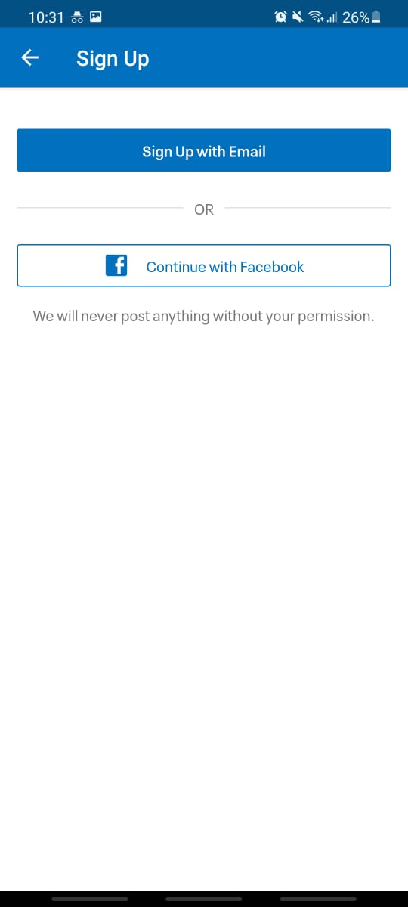
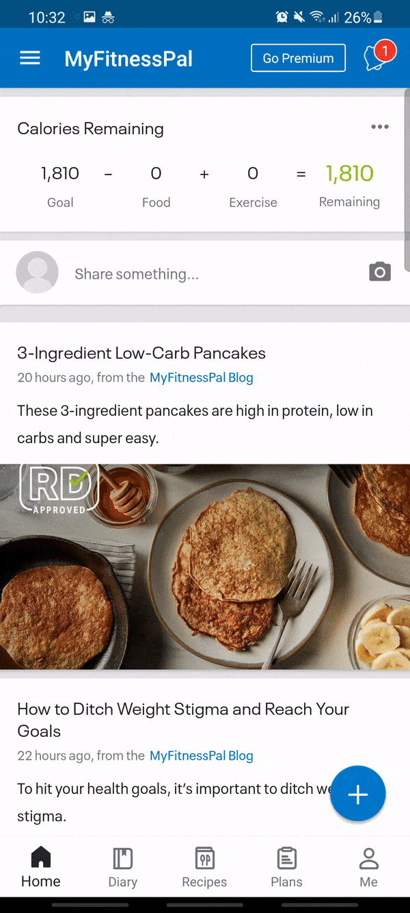
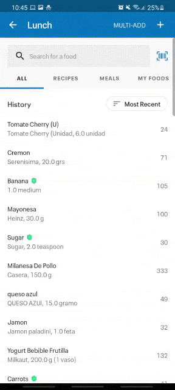

### We don't realize how little or much we eat until we start tracking it
I was sure I ate more than I needed to, always feeling full, but without reaching my goals.
A week's experiment using an app has proven me wrong.
I'll let you know how to count calories without becoming too crazy about it:

**The art of calorie-counting is a thing a lot of us, gym-goers, can start doing to keep an eye on the good old scale.**

You can start counting your calorie intake for two reasons:
- Gain weight in the form of muscle
- Lose fat, trying to keep the muscle you hardly earned

If you want to achieve any of those, keep in mind that you need **between 1.5 and 2 grams of protein per kg of weight**.
This is to keep your muscle and burn fat during a cut, and, to give fuel to your body when you are gaining size.

If you don't have any food disorder, and, if you aren't too obsessive - like me, calorie tracking has a lot of benefits:

- Get an overall picture of how much calories you eat daily
- Spot on which days you are more prone to over-eating
- Help cutting down sugary drinks and sugar in general
- Add some healthy fats to the mix
- Cut down on carbs
- Learn about food composition and macronutrients

### The plan
You can start with one week of tracking. I recommend using [MyFitnessPal](https://www.myfitnesspal.com/mobile/iphone) because it's easy to use, it has a bar code reader, and, it's _free_.
You should keep in mind that the first few days are the hardest. You need to log all the food and you've got nothing in your search history. After a while, it gets easier and you can fill your meals in under 1 minute or 2.

### The guide

  

1. Create your account either by using Facebook or your email. You will be asked about your goals, current weight and height. Don't worry if you're not sure about your goals yet, you can change them later. After the Signup process, log in to your account.

  

2. This is how the process of logging food to the app may look like

  

2. Keep in mind that you can use the bar scanner to log your food too!
3. You can also use a kitchen scale to weigh your food to be more precise. This way you'll be more aware of your current portion sizes. With this method, you'll stop making assumptions and you'll start knowing how much you ate on each meal.

### A word of caution
If you start using myfitnesspal regularly, you'll notice that there are some situations where the logging process is inaccurate.
For instance, when you go to eat in a restaurant with friends.
Or you have a friend's birthdate and he invites you to come over to his house to a dinner party.
Don't feel bad if you cant control _exactly_ how many grams of X or Y you took. Do your best and log your food by using the built-in search in myfitnesspal, there are a lot of elaborate dishes to look for. Guesstimate how much the food weighs and log it despite not being that precise. These events won't affect your calorie numbers that much. They are not that frequent anyway.
Remember that _having consistency trumps perfection._

### How should you weigh meat? Raw vs cooked
Most food we cook, change weight in the cooking process. They lose water and fat. They shrink and change color. That changes their actual weight.
Another thing to point out is that the cooking process varies depending on the way you cook. Fried isn't the same as oven-cooked, for instance.
As they state at [MyFitnessPal blog](https://blog.myfitnesspal.com/ask-the-rd-should-you-weigh-food-before-or-after-cooking/) _Most whole foods like whole grains, lean proteins, and vegetables typically come uncooked and are calculated for nutrition when uncooked._

For instance, meat may lose between 20 and 25% of volume when cooked. For vegetables, this number can go up to 50%.

For that reason, I recommend weighing all items before cooking. I must say that what's most important is to keep consistency. Just pick one: raw-weighting or cooked-weighting, and stick to it.

### Learning how to use the kitchen scale
Let's say you need to know how much a steak you're having for lunch weighs.
You need to put it in a vessel or container before you put it on the scale or your scale will get stained. But, you need to make sure you only measure the meat rather than also taking into account the recipient.
This is how you do it right:
You set the bowl and press TARE. This button resets the scale to 0 irrespective of the container.
Then, when you add meat - or anything - into the bowl, the numbers shown in the kitchen scale will only reflect the weight of the food itself.

### Final thoughts on the method
All in all, using a calorie tracker app makes it easier for us to keep a consistent log of what we eat.
Today it's easier than ever to do so. With most apps, you can also set reminders to log the food you ate that day.
The history and search feature of myfitnesspal also makes the process dead simple. Same with the bar scanner. In just 2 taps you get your meals logged!

What are you waiting to start keeping a log of your calorie intake? A smartphone and a kitchen scale are all you need to reach your new year's resolution.
